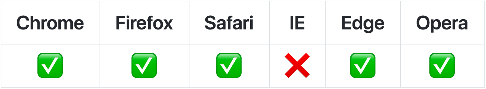
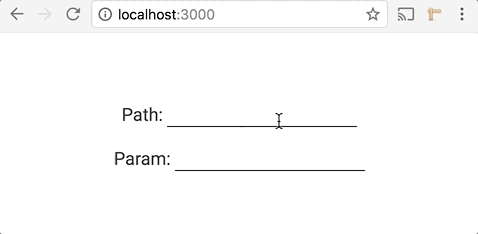

# React Easy Params

Auto synchronize your state with the URL and the LocalStorage :link:

[](https://circleci.com/gh/solkimicreb/react-easy-params/tree/master) [](https://coveralls.io/github/solkimicreb/react-easy-params) [](https://standardjs.com) [](https://unpkg.com/react-easy-params/dist/umd.es6.js)  [](https://www.npmjs.com/package/react-easy-params) [](https://david-dm.org/solkimicreb/react-easy-params) [](https://www.npmjs.com/package/react-easy-params)

<a href="#platform-support"></a>

<details>
<summary><strong>Table of Contents</strong></summary>
<!-- Do not edit the Table of Contents, instead regenerate with `npm run build-toc` -->

<!-- toc -->

* [Introduction](#introduction)
* [Installation](#installation)
* [API](#api)
  + [params](#params)
  + [setParams(object)](#setparamsobject)
  + [storage](#storage)
  + [setStorage(object)](#setstorageobject)
  + [path](#path)
  + [setPath(array)](#setpatharray)
* [Examples with live demos](#examples-with-live-demos)
* [Relation with [React Easy State](https://github.com/solkimicreb/react-easy-params)](#relation-with-react-easy-statehttpsgithubcomsolkimicrebreact-easy-params)
* [Platform support](#platform-support)
* [Alternative builds](#alternative-builds)
* [Contributing](#contributing)

<!-- tocstop -->

</details>

## Introduction

Easy Params is a tool for **small apps - without client-side routing**.

<div align="center">
  
</div>

It exposes two objects and an array, which synchronize with the corresponding browser APIs on mutations.

- The `params` object is reflected in the URL query parameters.
- The `path` array is reflected in the URL pathname.
- The `storage` object is persisted in the localStorage.

```js
import React from 'react'
import { view } from 'react-easy-state'
import { params, path } from 'react-easy-params'

const updateParam = ev => params.name = ev.target.value
const updatePath = ev => path[0] = ev.target.value

export default view(() =>
  <div>
    <div>Path: <input onChange={updatePath} value={path[0]} /></div>
    <div>Param: <input onChange={updateParam} value={params.name} /></div>
  </div>
)
```

Use it together with [React Easy State](https://github.com/solkimicreb/react-easy-state) for a smooth development flow.

## Installation

`npm install react-easy-params`

## API

### params

The `params` object is reflected in the URL query parameters. You should store primitive values - which define the current state - in it. Storing primitive user inputs in the URL query makes you page shareable and reloadable.

The synchronization is one directional. The URL always synchronizes with the `params` object, but the `params` object won't synchronize with the URL on browser history events. It will synchronize once - at page load - though.

### setParams(object)

Replaces the current `params` with the passed object. You should generally mutate `params` directly instead.

### storage

The `storage` object is persisted in the localStorage. You should store session related information - like the current API token or preferred site theme - in it.

The synchronization is one directional. The URL always synchronizes with the `path` array, but the  `path` array won't synchronize with the URL on browser history events. It will synchronize once - at page load - though.

### setStorage(object)

Replaces the current `storage` with the passed object. You should generally mutate `storage` directly instead.

### path

The `path` array is reflected in the URL pathname. It is provided for the sake of completeness, you should usually use the `params` object instead.

The synchronization is one directional. The URL always synchronizes with the `path` array, but the  `path` array won't synchronize with the URL on browser history events. It will synchronize once - at page load - though.

### setPath(array)

Replaces the current `path` with the passed array. You should generally mutate `path` directly instead.

## Examples with live demos

*Beginner*

- [Feature Demo](https://solkimicreb.github.io/react-easy-params/examples/feature-demo/build) ([source](/examples/feature-demo/)) ([codesandbox](https://codesandbox.io/s/github/solkimicreb/react-easy-params/tree/master/examples/feature-demo)): a dummy project, which demonstrates the URL synchronization of `params` and `path`.

*Advanced*

- [TodoMVC](https://solkimicreb.github.io/react-easy-params/examples/todo-mvc/build) ([source](/examples/todo-mvc/)) ([codesandbox](https://codesandbox.io/s/github/solkimicreb/react-easy-params/tree/master/examples/todo-mvc)): a dummy project, which demonstrates the URL synchronization of `params` and `path`.
- [Beer Finder](https://solkimicreb.github.io/react-easy-params/examples/beer-finder/build) ([source](/examples/beer-finder/)) ([codesandbox](https://codesandbox.io/s/github/solkimicreb/react-easy-params/tree/master/examples/beer-finder)): a dummy project, which demonstrates the URL synchronization of `params` and `path`.

## Relation with [React Easy State](https://github.com/solkimicreb/react-easy-params)

`params`, `path` and `storage` are Easy State [stores](https://github.com/solkimicreb/react-easy-state#creating-stores). If you use them inside your components, they re-render the component on their mutations - to reflect the changes. On top of this they are also reflected in the corresponding browser API.

## Platform support

- Node: 6 and above
- Chrome: 49 and above
- Firefox: 38 and above
- Safari: 10 and above
- Edge: 12 and above
- Opera: 36 and above
- IE is not supported

*This library is based on non polyfillable ES6 Proxies. Because of this, it will never support IE.*

## Alternative builds

This library detects if you use ES6 or commonJS modules and serve the right format to you. The exposed bundles are transpiled to ES5 to support common tools - like UglifyJS minifying. If you would like a finer control over the provided build, you can specify them in your imports.

- `react-easy-params/dist/es.es6.js` exposes an ES6 build with ES6 modules.
- `react-easy-params/dist/es.es5.js` exposes an ES5 build with ES6 modules.
- `react-easy-params/dist/cjs.es6.js` exposes an ES6 build with commonJS modules.
- `react-easy-params/dist/cjs.es5.js` exposes an ES5 build with commonJS modules.

If you use a bundler, set up an alias for `react-easy-params` to point to your desired build. You can learn how to do it with webpack [here](https://webpack.js.org/configuration/resolve/#resolve-alias) and with rollup [here](https://github.com/rollup/rollup-plugin-alias#usage).

## Contributing

Contributions are always welcome. Just send a PR against the master branch or open a new issue. Please make sure that the tests and the linter pass and the coverage remains decent. Thanks!
